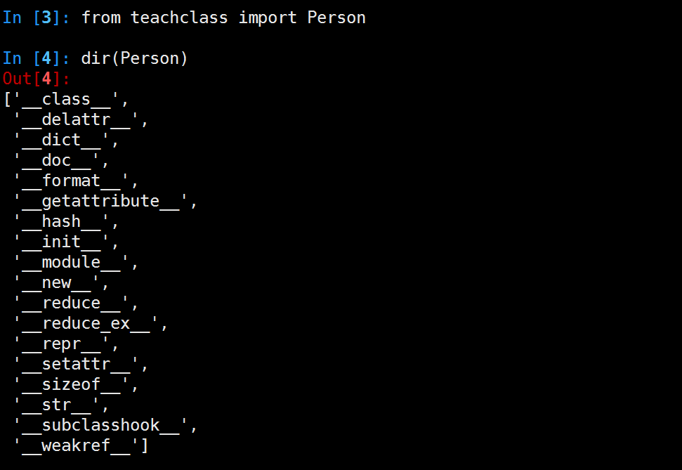
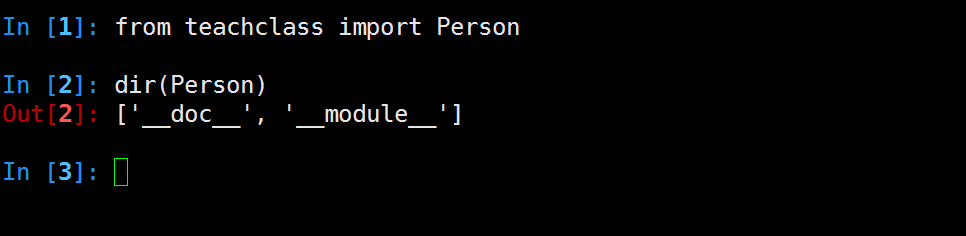

## 面向对象进阶

### 类进阶
### 类属性和实例属性关系

+ 实例属性 - 实例对象独有的属性
+ 类属性 - 类名访问类属性
+ 实例中无同名属性时，可访问到类属性，当定义同名实例属性时，则无法访问

>使用实例属性去修改类属性十分危险，原因在于实例拥有自己的属性集，修改类属性需要使用类名，而不是实例名。 


+ vars - 查看实例内属性(自定义的属性)
+ dir - 显示类属性和所有实例属性
+ type - 显示类型

### 类的方法
而在Python中，方法分为三类实例方法、类方法、静态方法。代码如下：

```python

　class Test(object):
    def instancefun(self):
        print("InstanceFun")
        print(self)

    @classmethod
    def classfun(cls):
        print("ClassFun")
        print(cls)

    @staticmethod
    def staticfun():
        print("StaticFun")
```

+ 实例方法 - 隐含的参数为类实例self
+ 类方法 - 隐含的参数为类本身cls
+ 静态方法 - 无隐含参数，主要为了类实例也可以直接调用静态方法。
+ 类名可以调用类方法和静态方法，但不可以调用实例方法


### 私有化

+ xx: 公有变量
+ _x: 单前置下划线,私有化属性或方法，from somemodule import *禁止导入,类对象和子类可以访问
+ __xx：双前置下划线,避免与子类中的属性命名冲突，无法在外部直接访问(名字重整所以访问不到)
+ \_\_xx\_\_:双前后下划线,用户名字空间的魔法对象或属性。例如:__init__ , __
不要自己发明这样的名字
+ xx_:单后置下划线,用于避免与Python关键词的冲突

通过name mangling（名字重整(目的就是以防子类意外重写基类的方法或者属性)如：_Class__object）机制就可以访问private了。

```python
#coding=utf-8

class Person(object):
    def __init__(self, name, age, taste):
        self.name = name
        self._age = age 
        self.__taste = taste

    def showperson(self):
        print(self.name)
        print(self._age)
        print(self.__taste)

    def dowork(self):
        self._work()
        self.__away()


    def _work(self):
        print('my _work')

    def __away(self):
        print('my __away')

class Student(Person):
    def construction(self, name, age, taste):
        self.name = name
        self._age = age 
        self.__taste = taste

    def showstudent(self):
        print(self.name)
        print(self._age)
        print(self.__taste)

    @staticmethod
    def testbug():
        _Bug.showbug()

#模块内可以访问，当from  cur_module import *时，不导入
class _Bug(object):
    @staticmethod
    def showbug():
        print("showbug")

s1 = Student('jack', 25, 'football')
s1.showperson()
print('*'*20)

#无法访问__taste,导致报错
#s1.showstudent() 
s1.construction('rose', 30, 'basketball')
s1.showperson()
print('*'*20)

s1.showstudent()
print('*'*20)

Student.testbug()
```


### 分析一个类

```python
class Person(object):
    pass
```

python2.7中类的内建属性和方法


python3.5中类的内建属性和方法


python2.7中经典类(旧式类)的内建属性和方法


>经典类(旧式类),早期如果没有要继承的父类,继承里空着不写的类


```python
#py2中无继承父类，称之经典类,py3中已默认继承object
class Person:
    pass
```

子类没有实现\__init\__方法时，默认自动调用父类的。
如定义\__init__方法时，需自己手动调用父类的  \_\_init\__方法

|    常用专有属性   |          说明         |                 触发方式                |
|-------------------|-----------------------|-----------------------------------------|
| \__init__         | 构造初始化函数        | 创建实例后,赋值时使用,在__new__后       |
| \__new__          | 生成实例所需属性      | 创建实例时                              |
| \__class__        | 实例所在的类          |           实例.\__class__                              |
| \__str__          | 实例字符串表示,可读性 | print(类实例),如没实现，使用repr结果    |
| \__repr__         | 实例字符串表示,准确性 | 类实例 回车 或者 print(repr(类实例))    |
| \__del__          | 析构                  | del删除实例                             |
| \__dict__         | 实例自定义属性        | vars(实例.__dict__)                     |
| \__doc__          | 类文档,子类不继承     | help(类或实例)                          |
| \__getattribute__ | 属性访问拦截器        | 访问实例属性时，优先级高于\__dict__访问 |

\__getattribute__例子:

```python
#coding=utf-8
class Itcast(object):
        def __init__(self,subject1):
            self.subject1 = subject1
            self.subject2 = 'cpp'

        #属性访问时拦截器，打log
        def __getattribute__(self,obj):
            if obj == 'subject1':
                print('log subject1')
                return 'redirect python'
            else:   #测试时注释掉这2行，将找不到subject2
                return object.__getattribute__(self,obj)

        def show(self):
            print 'this is Itcast'
    
s = Itcast('python')
print s.subject1
print s.subject2

```
####属性保护

`@property'成为属性函数，可以对属性赋值时做必要的检查，并保证代码的清晰短小，主要有2个作用

+ 将类方法转换为只读属性
+ 重新实现一个属性的设置和读取方法,可做边界判定

```python
#coding=utf-8

class Man(object):
    def __init__(self, name, age):
        self._name = name
        self._age = age 

    @property
    def name(self):
        return self._name

    @property
    def age(self):
        return self._age

    @age.setter
    def age(self, age):
        if not isinstance(age, int):
            raise ValueError('age should be int')
        if age < 0 or age > 150:
            raise ValueError('age should be 0-150')
        self._age = age 

m = Man('jack', 32) 
print(m.name)
print(m.age)
m.age = 40
print(m.age)
m.name = 'rose' #此处报错

```
当一个方法没有setter修饰时，无法设置该属性,如例子中的name。

### 面向对象设计

+ 继承 - 是基于Python中的属性查找(如X.name)
+ 多态 - 在X.method方法中，method的意义取决于X的类型
+ 封装 - 方法和运算符实现行为，数据隐藏默认是一种惯例

#### 思维锻炼
1. 设计讲师和学生类，讲师有上课，备课等方法，学生有听课，做练习等方法，均有姓名、性别、年龄等基本属性
2. 