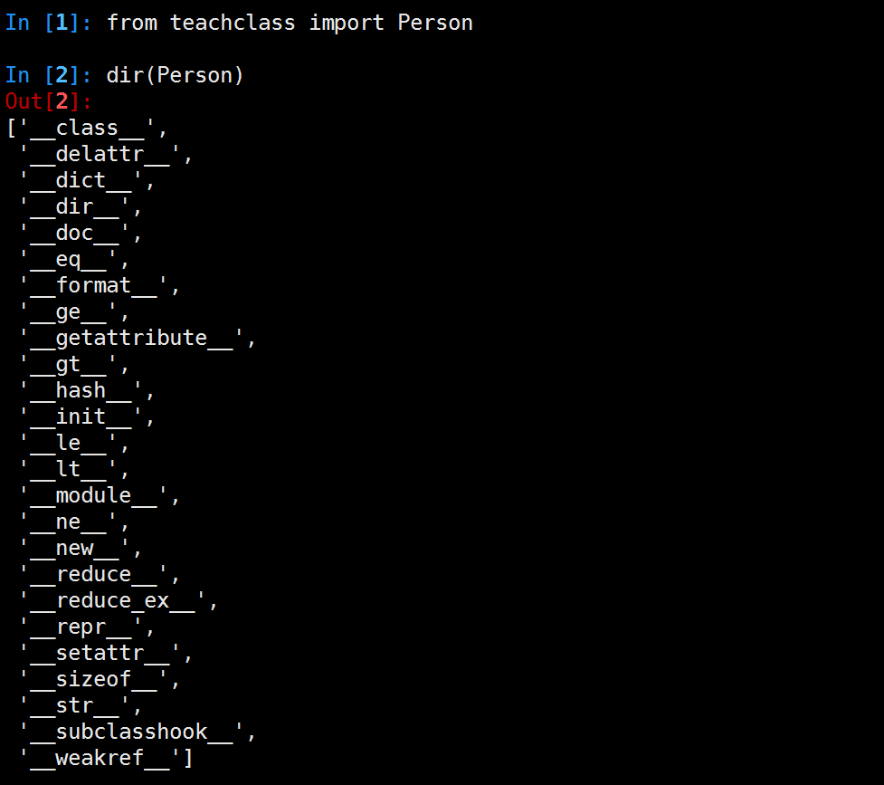

## 类进阶

### 私有化

+ __：双下划线开头属性或方法不允许在外部直接访问(名字混肴,所以访问不到)
+ _: 单下划线开头私有化属性或方法，from somemodule import *禁止导入
+ __xx__:
定义一个类

```python
class Person(object):
    pass
```

python2.7中类的内建属性和方法


python3.5中类的内建属性和方法


python2.7中经典类的内建属性和方法


```python
#py2中无继承父类，称之经典类,py3中已默认继承object
class Person:
    pass
```

####__slots__

合理使用__slots__属性可以节省一个对象所消耗的空间。一个普通对象使用一个dict来保存它自己的属性，你可以动态地向其中添加或删除属性，但是如果使用__slots__属性，那么该对象用来保存其自身属性的结构一旦创建则不能再进行任何修改。因此使用slot结构的对象节省了一部分开销。虽然有时这是一个很有用的优化方案，但是它也可能没那么有用，因为如果Python解释器足够动态，那么它完全可以在向对象添加属性时只请求该对象所使用的dict。