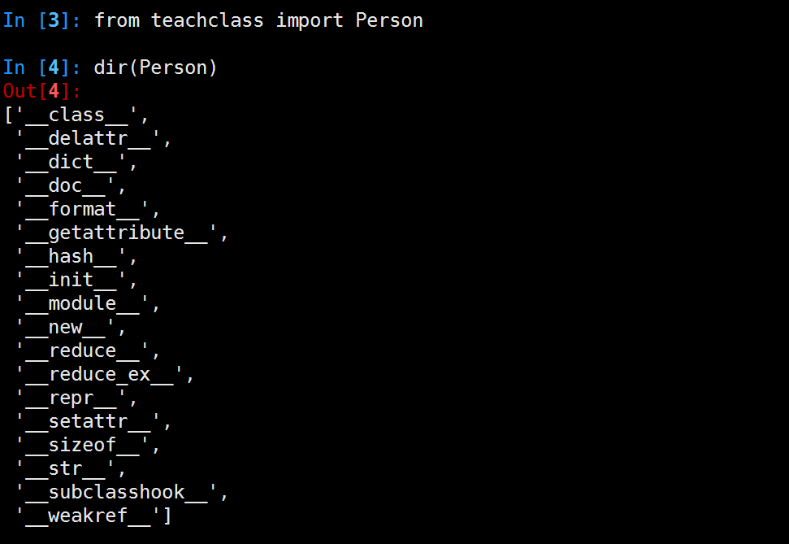
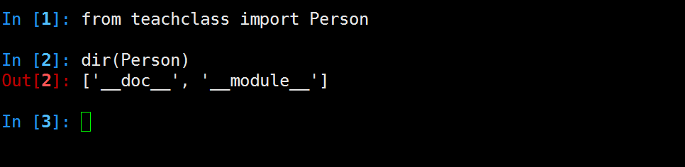

# 分析一个类

```python
class Person(object):
    pass
```

python2.7中类的内建属性和方法


python3.5中类的内建属性和方法


python2.7中经典类(旧式类)的内建属性和方法


>经典类(旧式类),早期如果没有要继承的父类,继承里空着不写的类


```python
#py2中无继承父类，称之经典类,py3中已默认继承object
class Person:
    pass
```

子类没有实现\__init\__方法时，默认自动调用父类的。
如定义\__init__方法时，需自己手动调用父类的  \_\_init\__方法

|    常用专有属性   |          说明         |                 触发方式                |
|-------------------|-----------------------|-----------------------------------------|
| \__init__         | 构造初始化函数        | 创建实例后,赋值时使用,在__new__后       |
| \__new__          | 生成实例所需属性      | 创建实例时                              |
| \__class__        | 实例所在的类          |           实例.\__class__                              |
| \__str__          | 实例字符串表示,可读性 | print(类实例),如没实现，使用repr结果    |
| \__repr__         | 实例字符串表示,准确性 | 类实例 回车 或者 print(repr(类实例))    |
| \__del__          | 析构                  | del删除实例                             |
| \__dict__         | 实例自定义属性        | vars(实例.__dict__)                     |
| \__doc__          | 类文档,子类不继承     | help(类或实例)                          |
| \__getattribute__ | 属性访问拦截器        | 访问实例属性时，优先级高于\__dict__访问 |

\__getattribute__例子:

```python
#coding=utf-8
class Itcast(object):
        def __init__(self,subject1):
            self.subject1 = subject1
            self.subject2 = 'cpp'

        #属性访问时拦截器，打log
        def __getattribute__(self,obj):
            if obj == 'subject1':
                print('log subject1')
                return 'redirect python'
            else:   #测试时注释掉这2行，将找不到subject2
                return object.__getattribute__(self,obj)

        def show(self):
            print 'this is Itcast'
    
s = Itcast('python')
print s.subject1
print s.subject2

```
####属性保护

`@property'成为属性函数，可以对属性赋值时做必要的检查，并保证代码的清晰短小，主要有2个作用

+ 将类方法转换为只读属性
+ 重新实现一个属性的设置和读取方法,可做边界判定

```python
#coding=utf-8

class Man(object):
    def __init__(self, name, age):
        self._name = name
        self._age = age 

    @property
    def name(self):
        return self._name

    @property
    def age(self):
        return self._age

    @age.setter
    def age(self, age):
        if not isinstance(age, int):
            raise ValueError('age should be int')
        if age < 0 or age > 150:
            raise ValueError('age should be 0-150')
        self._age = age 

m = Man('jack', 32) 
print(m.name)
print(m.age)
m.age = 40
print(m.age)
m.name = 'rose' #此处报错

```
当一个方法没有setter修饰时，无法设置该属性,如例子中的name。

