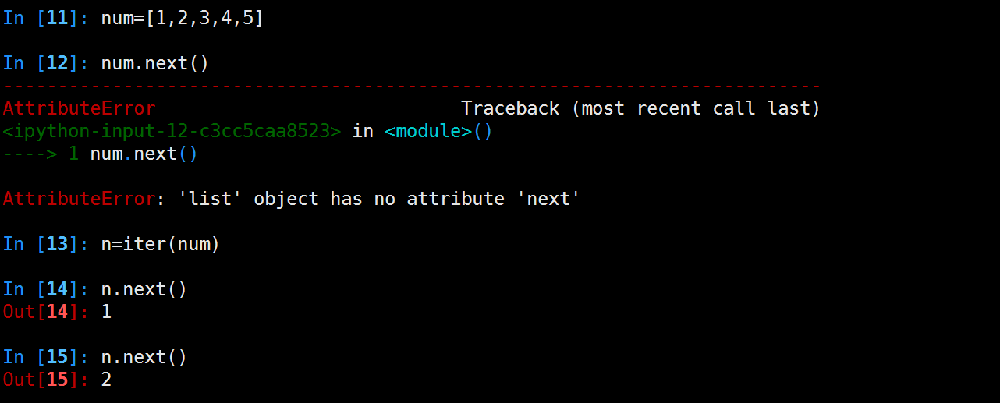

[TOC]
## 函数进阶
### 程序运行原理
一个程序是如何运行起来的？比如下面的代码
```python
#othermodule.py
def add(a, b):
    return a + b


#mainrun.py

import othermodule

a = ['itcast', 1, 'python']
a = 'other string'

def func():
    a = 1 
    b = 257 
    print(a + b)

print(a)

if __name__ == '__main__':
    func()
    res = othermodule.add(1, 2)
    print(res)

```
运行上述程序


#### 分析


#### LEGB 规则

Python 使用 LEGB 的顺序来查找一个符号对应的对象

    locals -> enclosing function -> globals -> builtins

+ locals，当前所在命名空间（如函数、模块），函数的参数也属于命名空间内的变量
+ enclosing，外部嵌套函数的命名空间（闭包中常见）
```python
def fun1():
    a = 10
    def fun2():
        # a 位于外部嵌套函数的命名空间
        print(a)
```
+ globals，全局变量，函数定义所在模块的命名空间
```python
a = 1
def fun():
    # 需要通过 global 指令来声明全局变量
    global a
    # 修改全局变量，而不是创建一个新的 local 变量
    a = 2
```
+ builtins，内建模块的命名空间。

        Python 在启动的时候会自动为我们载入很多内建的函数、类，
        比如 dict，list，type，print，这些都位于 __builtins__ 模块中，
        可以使用 dir(__builtins__) 来查看。
        这也是为什么我们在没有 import任何模块的情况下，
        就能使用这么多丰富的函数和功能了。

        在Python中，有一个内建模块，该模块中有一些常用函数;在Python启动后，
        且没有执行程序员所写的任何代码前，Python会首先加载该内建函数到内存。
        另外，该内建模块中的功能可以直接使用，不用在其前添加内建模块前缀，
        其原因是对函数、变量、类等标识符的查找是按LEGB法则，其中B即代表内建模块
        比如：内建模块中有一个abs()函数，其功能求绝对值，如abs(-20)将返回20。

            Python2.X版本中，内建模块被命名为 __builtin__
            Python3.X版本中，更名为 builtins
            Python2.X和Python3.X 是对内建模块一个引用 __builtins__


##### dir 函数

Python 的内置函数 dir 可以用来查看一个命名空间下的所有名字符号。一个用处是查看一个命名空间的所有属性和方法（这里的命名空间就是指类、函数、module）。

比如，查看当前的命名空间，可以使用 dir()，查看 sys 模块，可以使用 dir(sys)


#### 垃圾回收

##### 小整数对象池
整数在程序中的使用非常广泛，Python为了优化速度，使用了小整数对象池，
避免为整数频繁申请和销毁内存空间。

Python 对小整数的定义是 [-5, 257)
这些整数对象是提前建立好的，不会被垃圾回收。在一个 Python 
的程序中，所有位于这个范围内的整数使用的都是同一个对象.

同理，单个字母也是这样的。

但是当定义2个相同的字符串时，引用计数为0，触发垃圾回收
##### 大整数对象池
每一个大整数，均创建一个新的对象。


##### intern机制

```python
a1=”HelloWorld”
a2=”HelloWorld”
a3=”HelloWorld”
a4=”HelloWorld”
a5=”HelloWorld”
a6=”HelloWorld”
a7=”HelloWorld”
a8=”HelloWorld”
a9=”HelloWorld”
```
python会不会创建9个对象呢？在内存中会不会开辟9个”HelloWorld”的内存空间呢？
想一下，如果是这样的话，我们写10000个对象，比如a1=”HelloWorld”…..a1000=”HelloWorld”，
那他岂不是开辟了1000个”HelloWorld”所占的内存空间了呢？如果真这样，内存不就爆了吗？所以python中有这样一个机制——intern机制，让他只占用一个”HelloWorld”所占的内存空间。靠引用计数去维护何时释放。


##### 小结

+ 小整数[-5,257)共用对象，常驻内存
+ 单个字符共用对象，常驻内存
+ 单个单词，不可修改，默认开启intern机制，共用对象，引用计数为0，则销毁

+ 字符串（含有空格），不可修改，没开启intern机制，不共用对象，引用计数为0，销毁

+ 大整数不共用内存，引用计数为0，销毁


>备注：数值类型和字符串类型在 Python 中都是不可变的，这意味着你无法修改这个对象的值，每次对变量的修改，实际上是创建一个新的对象。


#### def 指令

def func()，在字节码指令中就是 MAKE_FUNCTION。
Python 是动态语言，def 实际上是执行一条指令，用来创建函数
（class 则是创建类的指令），而不仅仅是个语法关键字。
函数并不是事先创建好的，而是执行到的时候才创建的。

def func() 将会创建一个名称为 func 的函数对象。
实际上是先创建一个函数对象，然后将 func 这个名称符号绑定到这个函数上。

#### import 搜索路径 

```python
import sys
sys.path
```

##### 路径搜索

从上面列出的目录里依次查找要导入的模块文件

##### 程序执行时导入模块路径

```python
sys.path.append('/home/itcast/xxx')
sys.path.insert(0, '/home/itcast/xxx')    #可以确保先搜索这个路径
```
##### 设置Linux下导入模块路径

```shell
echo $PYTHONPATH
export PYTHONPATH=$PYTHONPATH:'/home/itcast/xxx'
```

##### 重新导入模块
模块被导入后，`import module`不能重新导入模块，重新导入需用

```python
reload(module)
```


#### pyc文件

pyc 文件是 PyCodeObject 对象在硬盘上的表现形式。生成pyc文件:

```shell
python -m py_compile xx_module.py
```

pyc文件三大作用

+ 创建时间，py文件比pyc文件新，则从新生成pyc
+ magic num做运行前版本检测，版本不同从新生成pyc
+ PyCodeObject 对象

在运行期间，编译结果也就是 PyCodeObject 对象，只会存在于内存中，而当这个模块的 Python 代码执行完后，就会将编译结果保存到了 pyc 文件中，这样下次就不用编译，直接加载到内存中。

这个 PyCodeObject 对象包含了 Python 源代码中的字符串，常量值，以及通过语法解析后编译生成的字节码指令。PyCodeObject 对象还会存储这些字节码指令与原始代码行号的对应关系，这样当出现异常时，就能指明位于哪一行的代码。


#### import 指令

import 指令是用来载入 module 的，如果需要，也会顺道做编译的事。但 import 指令，还会做一件重要的事情就是把 import 的那个 module 的代码执行一遍，这件事情很重要。
Python 是解释执行的，连函数都是执行的时候才创建的。如果不把那个 module 的代码执行一遍，那么 module 里面的函数都没法创建，更别提去调用这些函数了。

执行代码的另外一个重要作用，就是在这个 module 的命名空间中，创建模块内定义的函数和各种对象的符号名称（也就是变量名），并将其绑定到对象上，这样其他 module 才能通过变量名来引用这些对象。

Python 虚拟机还会将已经 import 过的 module 缓存起来，放到一个全局 module 集合 sys.modules 中。
这样做有一个好处，即如果程序的在另一个地方再次 import 这个模块，Python 虚拟机只需要将全局 module 集合中缓存的那个 module 对象返回即可。

>备注：如果一个正在运行的程序，模块内容修改，重新import无法更新，需要reload模块


### 闭包

内部函数对外部函数作用域里变量的引用（非全局变量），则称内部函数为闭包。

```python
# closure.py

def counter(start=0):
    count=[start]
    def incr():
        count[0] += 1
        return count[0]
    return incr
```

启动python解释器

    >>>import closeure
    >>>c1=closeure.counter(5)
    >>>print c1()
    6
    >>>print c1()
    7
    >>>c2=closeure.counter(100)
    >>>print c2()
    101
    >>>print c2()
    102


按值传递参数和按引用传递参数

    1.按值传递,单个变量
    2.按引用传递,列表


闭包思考：

    1.闭包似有化了变量，原来需要类对象完成的工作，闭包也可以完成
    2.由于闭包引用了外部函数的局部变量，则外部函数的局部变量没有及时释放，消耗内存


### 装饰器函数

装饰器(decorator)里引入通用功能处理

1. 引入日志
2. 函数执行时间统计
3. 执行函数前预备处理
4. 执行函数后清理功能
5. 权限校验等场景
6. 缓存

例1:无参数的函数

```python
#decorator.py

from time import ctime, sleep

def timefun(func):
    def wrappedfunc():
        print("%s called at %s"%(func.__name__, ctime()))
        return func()
    return wrappedfunc

@timefun
def foo():
    print("I am foo")

foo()
sleep(2)
foo()
```

上面代码理解装饰器执行行为可理解成

    foo = timefun(foo)
    #foo先作为参数赋值给func后,foo接收指向timefun返回的wrappedfunc
    foo()
    #调用foo(),即等价调用wrappedfunc()
    #内部函数wrappedfunc被引用，所以外部函数的func变量(自由变量)并没有释放
    #func里保存的是原foo函数对象

例2:被装饰的函数有参数
```python
#decorator2.py
from time import ctime, sleep

def timefun(func):
    def wrappedfunc(a, b):
        print("%s called at %s"%(func.__name__, ctime()))
        print(a, b)
        return func(a, b)
    return wrappedfunc

@timefun
def foo(a, b):
    print(a+b)

foo(3,5)
sleep(2)
foo(2,4)
```


例3:装饰器带参数,在原有装饰器的基础上，设置外部变量

```python
#decorator2.py

from time import ctime, sleep

def timefun_arg(pre="hello"):
    def timefun(func):
        def wrappedfunc():
            print("%s called at %s %s"%(func.__name__, ctime(), pre))
            return func()
        return wrappedfunc
    return timefun

@timefun_arg("itcast")
def foo():
    print("I am foo")

@timefun_arg("xwp")
def too():
    print("I am too")

foo()
sleep(2)
foo()

too()
sleep(2)
too()
```

可以理解为 

    foo()==timefun_arg("itcast")(foo)()

例4:装饰器和闭包混用(难)

```python

#coding=utf-8

from time import time

def logged(when):
    def log(f, *args, **kargs):
        print("fun:%s  args:%r  kargs:%r" %(f, args, kargs))
        #%r字符串的同时，显示原有对象类型

    def pre_logged(f):
        def wrapper(*args, **kargs):
            log(f, *args, **kargs)
            return f(*args, **kargs)
        return wrapper

    def post_logged(f):
        def wrapper(*args, **kargs):
            now=time()
            try:
                return f(*args, **kargs)
            finally:
                log(f, *args, **kargs)
                print("time delta: %s"%(time()-now))
        return wrapper
    try:
        return {"pre":pre_logged, "post":post_logged}[when]
    except KeyError, e:
        raise ValueError(e), 'must be "pre" or "post"'

@logged("post")
def fun(name):
    print("Hello, %s"%(name))

fun("itcastcpp!")
```

例5：类装饰器（扩展，非重点）

要定义类型的时候，实现__call__函数，这个类型就成为可调用的。
可以把这个类的对象当作函数来使用。

```python
class Itcast(object): 
    def __init__(self, func): 
        super(Itcast, self).__init__() 
        self._func = func 
  
    def __call__(self):  
        print 'class Itcast'  
        self._func()  
 
@Itcast
def showpy():
    print 'showpy'
  
showpy()
```


### 迭代器

在Python中，很多对象都是可以通过for语句来直接遍历的，例如list、string、dict等等，这些对象都可以被称为可迭代对象。至于说哪些对象是可以被迭代访问的，就要了解一下迭代器相关的知识了。

迭代器仅是一容器对象，它实现了迭代器协议。它有两个基本方法：

1. next方法, 返回容器的下一个元素
2. __iter__方法,返回迭代器自身



next()方法返回容器的下一个元素，在结尾时引发StopIteration异常。

对于可迭代对象，可以使用内建函数iter()来获取它的迭代器对象.


### 生成器函数

生成器是这样一个函数，它记住上一次返回时在函数体中的位置。对生成器函数的第二次（或第 n 次）调用跳转至该函数中间，而上次调用的所有局部变量都保持不变。

生成器不仅“记住”了它数据状态；生成器还“记住”了它在流控制构造（在命令式编程中，这种构造不只是数据值）中的位置。
生成器的特点：

     1.生成器是一个函数，而且函数的参数都会保留。
     2.迭代到下一次的调用时，所使用的参数都是第一次所保留下的，即是说，在整个所有函数调用的参数都是第一次所调用时保留的，而不是新创建的
     3.节约内存

例子：执行到yield时，gen函数作用暂时保存，返回x的值;tmp接收下次c.send("python")，send发送过来的值，c.next()等价c.send(None)

```python
#generation.py
def gen():
    for x in xrange(4):
        tmp = yield x
        if tmp == "hello":
            print "world"
        else:
            print "itcastcpp ", str(tmp)
```

执行如下

    >>>from generation import gen
    >>>c=gen()
    >>>c.next()
    0
    >>>c.next()
    itcastcpp None
    1
    >>>c.send("python")
    itcastcpp python
    2


#### 对比

当需要一个非常大的列表时，为了减少内存消耗，可以使用生成器

```python
class A(object):
    def __init__(self, i): 
        from time import sleep, time
        sleep(i)
        print (time())

```

+ []是通过遍历可迭代对象生成一个list
+ ()是直接返回可迭代对象

列表形式


生成器(元祖)形式


#### 小结

+ 无限递归成为可能
+ 极大的降低了线程或进程间上下文切换的开销
+ 用户手工指定纤程调用，避免了锁开销


### 内建函数

Build-in Function,启动python解释器，输入dir(__builtins__),
可以看到很多python解释器启动后默认加载的属性和函数，这些函数称之为内建函数，
这些函数因为在编程时使用较多，cpython解释器用c语言实现了这些函数，启动解释器
时默认加载。

这些函数数量众多，不宜记忆，开发时不是都用到的，待用到时再help(function),
查看如何使用，或结合百度查询即可，在这里介绍些常用的内建函数。

#### range

```python
    range(stop) -> list of integers
    range(start, stop[, step]) -> list of integers
```

+ start:计数从start开始。默认是从0开始。例如range（5）等价于range（0， 5）;
+ stop:到stop结束，但不包括stop.例如：range（0， 5） 是[0, 1, 2, 3, 4]没有5
+ step:每次跳跃的间距，默认为1。例如：range（0， 5） 等价于 range(0, 5, 1)

python2中range返回列表，python3中range返回一个迭代值。如果想得到列表,可通过list函数

```python
a = range(5)
list(a)
```

#### map

```python
    map(...)
        map(function, sequence[, sequence, ...]) -> list
```

+ function:是一个函数
+ sequence:是一个或多个序列,取决于function需要几个参数
+ 返回值是一个list

参数序列中的每一个元素分别调用function函数，返回包含每次function函数返回值的list。

```shell
#函数需要一个参数
map(lambda x: x*x, [1, 2, 3])
[1, 4, 9]

#函数需要两个参数
map(lambda x, y: x+y, [1, 2, 3], [4, 5, 6])
[5, 7, 9]

#函数为None,相当于合并参数为元祖
map(None, [1, 3, 5, 7, 9], [2, 4, 6, 8, 10])
[(1, 2), (3, 4), (5, 6), (7, 8), (9, 10)]

#两个序列参数个数不一致时，个数少的补None
map(None, [1, 3, 5, 7, 9], [2, 4, 6])
[(1, 2), (3, 4), (5, 6), (7, None), (9, None)]


```


#### filter

```python
filter(...)
    filter(function or None, sequence) -> list, tuple, or string

    Return those items of sequence for which function(item) is true.  If
    function is None, return the items that are true.  If sequence is a tuple
    or string, return the same type, else return a list.
```

+ function:接受一个参数，返回布尔值True或False
+ sequence:序列可以是str，tuple，list

filter函数会对序列参数sequence中的每个元素调用function函数，最后返回的结果包含调用结果为True的元素。

返回值的类型和参数sequence的类型相同


```shell
filter(lambda x: x%2, [1, 2, 3, 4])
[1, 3]

filter(None, "she")
'she'
```
#### reduce

```python
reduce(...)
    reduce(function, sequence[, initial]) -> value
    
    Apply a function of two arguments cumulatively to the items of a sequence,
    from left to right, so as to reduce the sequence to a single value.
    For example, reduce(lambda x, y: x+y, [1, 2, 3, 4, 5]) calculates
    ((((1+2)+3)+4)+5).  If initial is present, it is placed before the items
    of the sequence in the calculation, and serves as a default when the
    sequence is empty.

```
+ function:该函数有两个参数
+ sequence:序列可以是str，tuple，list
+ initial:固定初始值

reduce依次从sequence中取一个元素，和上一次调用function的结果做参数再次调用function。
第一次调用function时，如果提供initial参数，会以sequence中的第一个元素和initial
作为参数调用function，否则会以序列sequence中的前两个元素做参数调用function。
注意function函数不能为None。

```shell
reduce(lambda x, y: x+y, [1,2,3,4])
10

reduce(lambda x, y: x+y, [1,2,3,4], 5)
15

reduce(lambda x, y: x+y, ['aa', 'bb', 'cc'], 'dd')
'ddaabbcc'

```

>在Python3里,reduce函数已经被从全局名字空间里移除了,
它现在被放置在fucntools模块里用的话要先引入：
>>> from functools import reduce 

#### sorted函数

```python
sorted(...)
    sorted(iterable, cmp=None, key=None, reverse=False) --> new sorted list
```


自定义cmp比较函数，返回三种情况：

+ x<y 返回-1
+ x>y 返回1
+ x==y 返回0

```python
def cmp_ignore_case(s1, s2):
    u1 = s1.upper()
    u2 = s2.upper()
    if u1 < u2:
        return -1
    if u1 > u2:
        return 1
    return 0
```
### functools函数
functools 是python2.5被引人的,一些工具函数放在此包里。

python2.7中


python3.5中

```python
import functools
dir(functools)
```

python3中增加了更多工具函数，做业务开发时大多情况下用不到，此处介绍使用频率较高的2个函数。

#### partial函数(偏函数)

把一个函数的某些参数设置默认值，返回一个新的函数，调用这个新函数会更简单。
```python
import functools

def showarg(*args, **kw):
    print(args)
    print(kw)

p1=functools.partial(showarg, 1,2,3)
p1()
p1(4,5,6)
p1(a='python', b='itcast')

p2=functools.partial(showarg, a=3,b='linux')
p2()
p2(1,2)
p2(a='python', b='itcast')
```


#### wraps函数

使用装饰器时，有一些细节需要被注意。例如，被装饰后的函数其实已经是另外一个函数了（函数名等函数属性会发生改变）。

添加后由于函数名和函数的doc发生了改变，对测试结果有一些影响，例如:

```python
def note(func):
    "note function"
    def wrapper():
        "wrapper function"
        print('note something')
        return func()
    return wrapper

@note
def test():
    "test function"
    print('I am test')

test()
print(test.__doc__)
```

所以，Python的functools包中提供了一个叫wraps的装饰器来消除这样的副作用。例如：

```python
import functools
def note(func):
    "note function"
    @functools.wraps(func)
    def wrapper():
        "wrapper function"
        print('note something')
        return func()
    return wrapper

@note
def test():
    "test function"
    print('I am test')

test()
print(test.__doc__)
```
