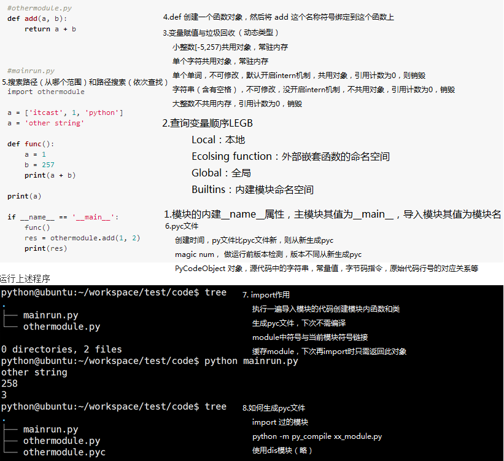
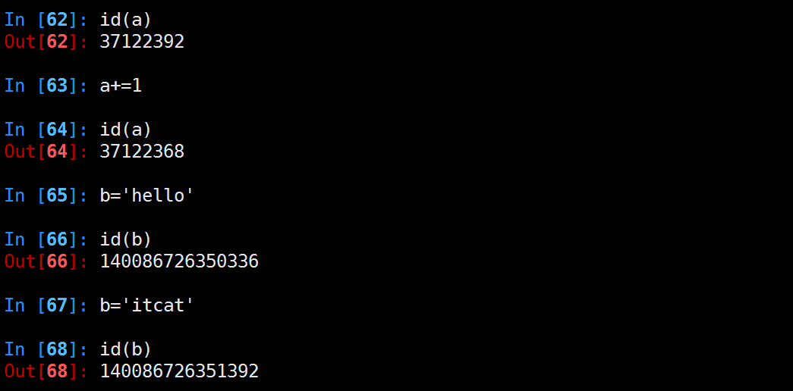

# 程序运行原理

一个程序是如何运行起来的？比如下面的代码
```python
#othermodule.py
def add(a, b):
    return a + b


#mainrun.py

import othermodule

a = ['itcast', 1, 'python']
a = 'other string'

def func():
    a = 1 
    b = 257 
    print(a + b)

print(a)

if __name__ == '__main__':
    func()
    res = othermodule.add(1, 2)
    print(res)

```
运行上述程序


#### 分析



#### LEGB 规则

Python 使用 LEGB 的顺序来查找一个符号对应的对象

    locals -> enclosing function -> globals -> builtins

+ locals，当前所在命名空间（如函数、模块），函数的参数也属于命名空间内的变量
+ enclosing，外部嵌套函数的命名空间（闭包中常见）
```python
def fun1():
    a = 10
    def fun2():
        # a 位于外部嵌套函数的命名空间
        print(a)
```
+ globals，全局变量，函数定义所在模块的命名空间
```python
a = 1
def fun():
    # 需要通过 global 指令来声明全局变量
    global a
    # 修改全局变量，而不是创建一个新的 local 变量
    a = 2
```
+ builtins，内建模块的命名空间。

        Python 在启动的时候会自动为我们载入很多内建的函数、类，
        比如 dict，list，type，print，这些都位于 __builtins__ 模块中，
        可以使用 dir(__builtins__) 来查看。
        这也是为什么我们在没有 import任何模块的情况下，
        就能使用这么多丰富的函数和功能了。

        在Python中，有一个内建模块，该模块中有一些常用函数;在Python启动后，
        且没有执行程序员所写的任何代码前，Python会首先加载该内建函数到内存。
        另外，该内建模块中的功能可以直接使用，不用在其前添加内建模块前缀，
        其原因是对函数、变量、类等标识符的查找是按LEGB法则，其中B即代表内建模块
        比如：内建模块中有一个abs()函数，其功能求绝对值，如abs(-20)将返回20。

            Python2.X版本中，内建模块被命名为 __builtin__
            Python3.X版本中，更名为 builtins
            Python2.X和Python3.X 是对内建模块一个引用 __builtins__


##### dir 函数

Python 的内置函数 dir 可以用来查看一个命名空间下的所有名字符号。一个用处是查看一个命名空间的所有属性和方法（这里的命名空间就是指类、函数、module）。

比如，查看当前的命名空间，可以使用 dir()，查看 sys 模块，可以使用 dir(sys)


#### 垃圾回收

##### 小整数对象池
整数在程序中的使用非常广泛，Python为了优化速度，使用了小整数对象池，
避免为整数频繁申请和销毁内存空间。

Python 对小整数的定义是 [-5, 257)
这些整数对象是提前建立好的，不会被垃圾回收。在一个 Python 
的程序中，所有位于这个范围内的整数使用的都是同一个对象.

同理，单个字母也是这样的。

但是当定义2个相同的字符串时，引用计数为0，触发垃圾回收
##### 大整数对象池
每一个大整数，均创建一个新的对象。


##### intern机制

```python
a1=”HelloWorld”
a2=”HelloWorld”
a3=”HelloWorld”
a4=”HelloWorld”
a5=”HelloWorld”
a6=”HelloWorld”
a7=”HelloWorld”
a8=”HelloWorld”
a9=”HelloWorld”
```
python会不会创建9个对象呢？在内存中会不会开辟9个”HelloWorld”的内存空间呢？
想一下，如果是这样的话，我们写10000个对象，比如a1=”HelloWorld”…..a1000=”HelloWorld”，
那他岂不是开辟了1000个”HelloWorld”所占的内存空间了呢？如果真这样，内存不就爆了吗？所以python中有这样一个机制——intern机制，让他只占用一个”HelloWorld”所占的内存空间。靠引用计数去维护何时释放。


##### 小结

+ 小整数[-5,257)共用对象，常驻内存
+ 单个字符共用对象，常驻内存
+ 单个单词，不可修改，默认开启intern机制，共用对象，引用计数为0，则销毁

+ 字符串（含有空格），不可修改，没开启intern机制，不共用对象，引用计数为0，销毁

+ 大整数不共用内存，引用计数为0，销毁


>备注：数值类型和字符串类型在 Python 中都是不可变的，这意味着你无法修改这个对象的值，每次对变量的修改，实际上是创建一个新的对象。


#### def 指令

def func()，在字节码指令中就是 MAKE_FUNCTION。
Python 是动态语言，def 实际上是执行一条指令，用来创建函数
（class 则是创建类的指令），而不仅仅是个语法关键字。
函数并不是事先创建好的，而是执行到的时候才创建的。

def func() 将会创建一个名称为 func 的函数对象。
实际上是先创建一个函数对象，然后将 func 这个名称符号绑定到这个函数上。

#### import 搜索路径 

```python
import sys
sys.path
```

##### 路径搜索

从上面列出的目录里依次查找要导入的模块文件

##### 程序执行时导入模块路径

```python
sys.path.append('/home/itcast/xxx')
sys.path.insert(0, '/home/itcast/xxx')    #可以确保先搜索这个路径
```
##### 设置Linux下导入模块路径

```shell
echo $PYTHONPATH
export PYTHONPATH=$PYTHONPATH:'/home/itcast/xxx'
```

##### 重新导入模块
模块被导入后，`import module`不能重新导入模块，重新导入需用

```python
reload(module)
```


#### pyc文件

pyc 文件是 PyCodeObject 对象在硬盘上的表现形式。生成pyc文件:

```shell
python -m py_compile xx_module.py
```

pyc文件三大作用

+ 创建时间，py文件比pyc文件新，则从新生成pyc
+ magic num做运行前版本检测，版本不同从新生成pyc
+ PyCodeObject 对象

在运行期间，编译结果也就是 PyCodeObject 对象，只会存在于内存中，而当这个模块的 Python 代码执行完后，就会将编译结果保存到了 pyc 文件中，这样下次就不用编译，直接加载到内存中。

这个 PyCodeObject 对象包含了 Python 源代码中的字符串，常量值，以及通过语法解析后编译生成的字节码指令。PyCodeObject 对象还会存储这些字节码指令与原始代码行号的对应关系，这样当出现异常时，就能指明位于哪一行的代码。


#### import 指令

import 指令是用来载入 module 的，如果需要，也会顺道做编译的事。但 import 指令，还会做一件重要的事情就是把 import 的那个 module 的代码执行一遍，这件事情很重要。
Python 是解释执行的，连函数都是执行的时候才创建的。如果不把那个 module 的代码执行一遍，那么 module 里面的函数都没法创建，更别提去调用这些函数了。

执行代码的另外一个重要作用，就是在这个 module 的命名空间中，创建模块内定义的函数和各种对象的符号名称（也就是变量名），并将其绑定到对象上，这样其他 module 才能通过变量名来引用这些对象。

Python 虚拟机还会将已经 import 过的 module 缓存起来，放到一个全局 module 集合 sys.modules 中。
这样做有一个好处，即如果程序的在另一个地方再次 import 这个模块，Python 虚拟机只需要将全局 module 集合中缓存的那个 module 对象返回即可。

>备注：如果一个正在运行的程序，模块内容修改，重新import无法更新，需要reload模块
