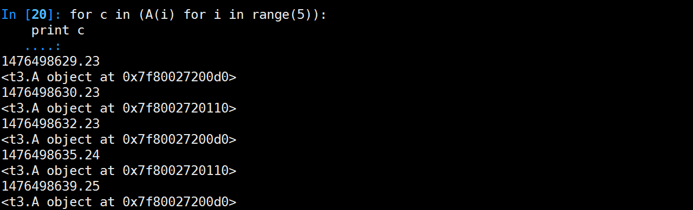

# 生成器


生成器是这样一个函数，它记住上一次返回时在函数体中的位置。对生成器函数的第二次（或第 n 次）调用跳转至该函数中间，而上次调用的所有局部变量都保持不变。

生成器不仅“记住”了它数据状态；生成器还“记住”了它在流控制构造（在命令式编程中，这种构造不只是数据值）中的位置。
生成器的特点：

     1.生成器是一个函数，而且函数的参数都会保留。
     2.迭代到下一次的调用时，所使用的参数都是第一次所保留下的，即是说，在整个所有函数调用的参数都是第一次所调用时保留的，而不是新创建的
     3.节约内存

例子：执行到yield时，gen函数作用暂时保存，返回x的值;tmp接收下次c.send("python")，send发送过来的值，c.next()等价c.send(None)

```python
#generation.py
def gen():
    for x in xrange(4):
        tmp = yield x
        if tmp == "hello":
            print "world"
        else:
            print "itcastcpp ", str(tmp)
```

执行如下

    >>>from generation import gen
    >>>c=gen()
    >>>c.next()
    0
    >>>c.next()
    itcastcpp None
    1
    >>>c.send("python")
    itcastcpp python
    2


#### 对比

当需要一个非常大的列表时，为了减少内存消耗，可以使用生成器

```python
class A(object):
    def __init__(self, i): 
        from time import sleep, time
        sleep(i)
        print (time())

```

+ []是通过遍历可迭代对象生成一个list
+ ()是直接返回可迭代对象

列表形式


生成器(元祖)形式


#### 小结

+ 无限递归成为可能
+ 极大的降低了线程或进程间上下文切换的开销
+ 用户手工指定纤程调用，避免了锁开销

