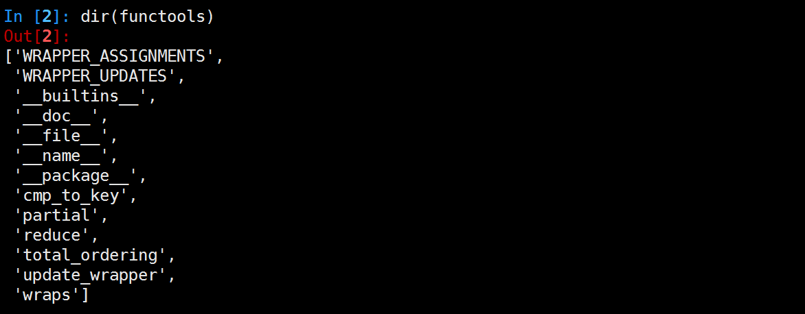

# functools函数

functools 是python2.5被引人的,一些工具函数放在此包里。

python2.7中



python3.5中

```python
import functools
dir(functools)
```

python3中增加了更多工具函数，做业务开发时大多情况下用不到，此处介绍使用频率较高的2个函数。

#### partial函数(偏函数)

把一个函数的某些参数设置默认值，返回一个新的函数，调用这个新函数会更简单。
```python
import functools

def showarg(*args, **kw):
    print(args)
    print(kw)

p1=functools.partial(showarg, 1,2,3)
p1()
p1(4,5,6)
p1(a='python', b='itcast')

p2=functools.partial(showarg, a=3,b='linux')
p2()
p2(1,2)
p2(a='python', b='itcast')
```


#### wraps函数

使用装饰器时，有一些细节需要被注意。例如，被装饰后的函数其实已经是另外一个函数了（函数名等函数属性会发生改变）。

添加后由于函数名和函数的doc发生了改变，对测试结果有一些影响，例如:

```python
def note(func):
    "note function"
    def wrapper():
        "wrapper function"
        print('note something')
        return func()
    return wrapper

@note
def test():
    "test function"
    print('I am test')

test()
print(test.__doc__)
```

所以，Python的functools包中提供了一个叫wraps的装饰器来消除这样的副作用。例如：

```python
import functools
def note(func):
    "note function"
    @functools.wraps(func)
    def wrapper():
        "wrapper function"
        print('note something')
        return func()
    return wrapper

@note
def test():
    "test function"
    print('I am test')

test()
print(test.__doc__)
```
