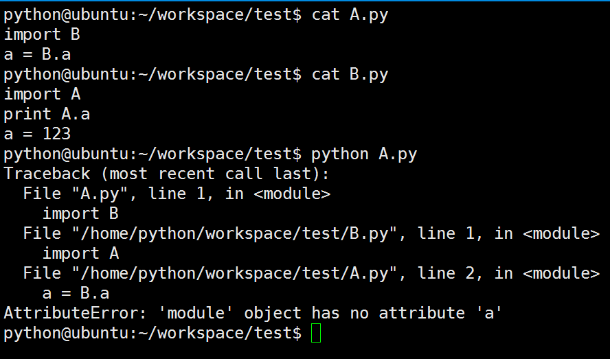
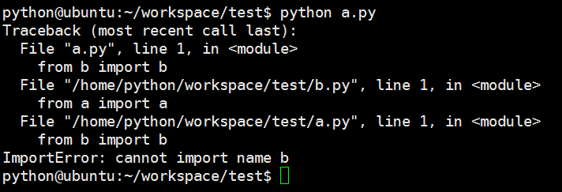
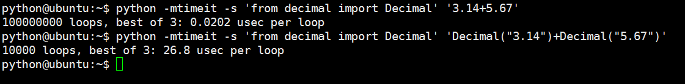

# 其它

### 为什么有了列表还需要元祖
两者的性质不同: 元祖中的元素不可变，列表可变。元祖的不可变性提供了某种完整性，这样你可以确保元祖在程序中不会被另一个引用改变，而列表就没法保证了。

元祖可以用在列表无法使用的情况中，例如，集合。因为集合中的元素是不可变的，当添加列表到集合中时会报错，而添加元素却不会报错。
    

### 引用vs拷贝
+ 引用
    赋值操作产生对象的引用。
    
    例如: a = "abc"，a就是对于字符串对象"abc"的引用。
    
+ 浅拷贝
    + 浅拷贝是对于一个对象的顶层拷贝。
    
    + 如何浅拷贝
        + 分片表达式可以赋值一个序列
            
            a = "abc"
            
            b = a[:]
            
        + 字典的copy方法可以拷贝一个字典
            
            d = dict(name="zhangsan", age=27")
            
            co = d.copy()
        
        + 有些内置函数可以生成拷贝(list)
        
            a = list(range(10))
            
            b = list(a)
        
        + copy模块中的copy函数
        
            import copy
            
            a = (1,2,3)
            
            b = copy.copy(a)
        
+ 深拷贝
    + 深拷贝是对于一个对象所有层次的拷贝(递归)。
    
    + 如何深拷贝
    
        copy模块中的deepcopy函数。
        
        import copy
        
        a = ["name", [1,2,3], "age"]
        
        co = copy.deepcopy(a)

### 循环导入
#### 为什么会出现循环导入



再看一个例子


a.py
```python
from b import b 

print '---------this is module a.py----------'
def a():
    print "hello, a"   
    b() 

a()
```
b.py
```python
from a import a

print '----------this is module b.py----------'
def b():
    print "hello, b"

def c():
    a() 
c()
```
运行python a.py



#### 怎样避免循环导入

1. 程序设计上分层，降低耦合
2. 导入语句放在后面需要导入时再导入
3. 放在函数体内导入


### 共享引用和相等

在Python中先创建一个对象，然后再将变量指向所创建的对象。
对于每个对象，都有一个头部信息，在信息中就标记了这个对象的类型信息。每当一个变量名被赋予了一个新的对象，之前那个对象占用的空间就回被回收（如果此时这个对象没有被别的变量名或者对象所引用的话）。另外，在python中，每个对象都保有一个计数器，计数器中记录了这个对象被引用的次数，当这个计数器被置为0时，对象所占用的内存空间就会被释放，即当做垃圾回收。
共享引用：
在python中，变量总是一个指向对象的指针，而不是可以改变的内存区域标签。给一个变量赋予一个新的值，不是替换了原始的对象，而是让这个变量去引用一个新的对象，实际效果就是对变量重新赋值，这仅仅会影响到那个被重新赋值的变量。
另外，在这里说一下 “ == ”和“ is ”这个操作符
==，和C语言中的作用是一样的，测试两个被引用的对象的值是否一致；
is，检查两个对象的同一性，判断两个对象名是否指向同一地址空间，如果是则返回True
创建两个列表对象，即使它们的值相同，也是来源于不同的空间。因此is的比较结果为假.
在内存中，小的整数和字符串被缓存复用了，所以is才告诉我们小整数a和b是引用了相同的对象。

### 语句执行时间

+ 测试语句运行时间
```python
python -mtimeit -s 'from decimal import Decimal' '3.14+5.67'
python -mtimeit -s 'from decimal import Decimal' 'Decimal("3.14")+Decimal("5.67")'
```


+ 测试函数运行时间

```python
import time
 
def time_me(fn):
    def _wrapper(*args, **kwargs):
        start = time.clock()
        fn(*args, **kwargs)
        print("%s cost %s second"%(fn.__name__, time.clock() - start))
    return _wrapper
 
@time_me
def test(x, y):
    time.sleep(0.1)
 
@time_me
def test2(x):
    time.sleep(0.2)
 
test(1, 2)
test2(2)
```

+ 测试文件运行时间

```shell
$ time -p python testfile.py

Total time running : 1.3931210041 seconds
real 1.49    表示的是执行脚本的总时间
user 1.40    表示的是执行脚本消耗的CPU时间。
sys 0.08     表示的是执行内核函数消耗的时间
```


## 协程

网络编程目前有四种方式：

+ 多进程
+ 多线程
+ 异步(多路I/O复用)
+ 协程


协程，又称微线程，纤程。英文名Coroutine。

### 协程是啥
首先我们得知道协程是啥？协程其实可以认为是比线程更小的执行单元。
为啥说他是一个执行单元，因为他自带CPU上下文。这样只要在合适的时机，
我们可以把一个协程 切换到另一个协程。
只要这个过程中保存或恢复 CPU上下文那么程序还是可以运行的。


### 协程和线程差异

那么这个过程看起来比线程差不多。其实不然, 线程切换从系统层面远不止保存和恢复 CPU上下文这么简单。
操作系统为了程序运行的高效性每个线程都有自己缓存Cache等等数据，操作系统还会帮你做这些数据的恢复操作。
所以线程的切换非常耗性能。但是协程的切换只是单纯的操作CPU的上下文，所以一秒钟切换个上百万次系统都抗的住。


### 协程的问题
但是协程有一个问题，就是系统并不感知，所以操作系统不会帮你做切换。
那么谁来帮你做切换？让需要执行的协程更多的获得CPU时间才是问题的关键。


### 例子

目前的协程框架一般都是设计成 1:N 模式。所谓 1:N 就是一个线程作为一个容器里面放置多个协程。
那么谁来适时的切换这些协程？答案是有协程自己主动让出CPU，也就是每个协程池里面有一个调度器，
这个调度器是被动调度的。意思就是他不会主动调度。而且当一个协程发现自己执行不下去了(比如异步等待网络的数据回来，但是当前还没有数据到)，
这个时候就可以由这个协程通知调度器，这个时候执行到调度器的代码，调度器根据事先设计好的调度算法找到当前最需要CPU的协程。
切换这个协程的CPU上下文把CPU的运行权交个这个协程，直到这个协程出现执行不下去需要等等的情况，或者它调用主动让出CPU的API之类，触发下一次调度。
对的没错就是类似于领导人模式

### 那么这个实现有没有问题？

其实是有问题的，假设这个线程中有一个协程是CPU密集型的他没有IO操作，
也就是自己不会主动触发调度器调度的过程，那么就会出现其他协程得不到执行的情况，
所以这种情况下需要程序员自己避免。这是一个问题，假设业务开发的人员并不懂这个原理的话就可能会出现问题。

### 协程的好处

在IO密集型的程序中由于IO操作远远小于CPU的操作，所以往往需要CPU去等IO操作。
同步IO下系统需要切换线程，让操作系统可以再IO过程中执行其他的东西。
这样虽然代码是符合人类的思维习惯但是由于大量的线程切换带来了大量的性能的浪费，尤其是IO密集型的程序。

所以人们发明了异步IO。就是当数据到达的时候触发我的回调。来减少线程切换带来性能损失。
但是这样的坏处也是很大的，主要的坏处就是操作被 “分片” 了，代码写的不是 “一气呵成” 这种。 
而是每次来段数据就要判断 数据够不够处理哇，够处理就处理吧，不够处理就在等等吧。这样代码的可读性很低，其实也不符合人类的习惯。 

但是协程可以很好解决这个问题。比如 把一个IO操作 写成一个协程。当触发IO操作的时候就自动让出CPU给其他协程。要知道协程的切换很轻的。
协程通过这种对异步IO的封装 既保留了性能也保证了代码的容易编写和可读性。在高IO密集型的程序下很好。但是高CPU密集型的程序下没啥好处。


### 协程一个简单实现

```python
import time

def consumer():
    r = ''
    while True:
        n = yield r
        if not n:
            return
        print('[CONSUMER] Consuming %s...' % n)
        time.sleep(1)
        r = '200 OK'

def produce(c):
    c.next()
    n = 0
    while n < 5:
        n = n + 1
        print('[PRODUCER] Producing %s...' % n)
        r = c.send(n)
        print('[PRODUCER] Consumer return: %s' % r)
    c.close()

if __name__=='__main__':
    c = consumer()
    produce(c)
```

### Gevent协程解决方案

gevent是基于协程的Python网络库。
特点： 基于libev的快速事件循环(Linux上epoll，FreeBSD上kqueue）。
基于greenlet的轻量级执行单元。 

Gevent提供了看上去非常像传统的基于线程模型编程的接口，但是在隐藏在下面做的是异步I/O。

安装

    pip install gevent

上面例子使gevent.socket进行socket操作。如果使用标准socket模块将有3倍耗时。

monkey patching用兼容副本替换标准socket模块的函数和类。


```python
from gevent import monkey; monkey.patch_socket()
import gevent

def f(n):
    for i in range(n):
        print gevent.getcurrent(), i

g1 = gevent.spawn(f, 5)
g2 = gevent.spawn(f, 5)
g3 = gevent.spawn(f, 5)
g1.join()
g2.join()
g3.join()

```

增加睡眠语句，观察切换

```python
from gevent import monkey; monkey.patch_socket()
import gevent

def f(n):
    for i in range(n):
        print gevent.getcurrent(), i
        gevent.sleep(0)

g1 = gevent.spawn(f, 5)
g2 = gevent.spawn(f, 5)
g3 = gevent.spawn(f, 5)
g1.join()
g2.join()
g3.join()

```
然后在操作系统的进程管理器中看，线程数只有1个。

当然，实际代码里，我们不会用gevent.sleep()去切换协程，
而是在执行到IO操作时，gevent自动切换

```python
from gevent import monkey; monkey.patch_all()
import gevent
import urllib2

def f(url):
    print('GET: %s' % url)
    resp = urllib2.urlopen(url)
    data = resp.read()
    print('%d bytes received from %s.' % (len(data), url))

gevent.joinall([
        gevent.spawn(f, 'https://www.yahoo.com/'),
        gevent.spawn(f, 'https://www.python.org/'),
        gevent.spawn(f, 'https://github.com/'),
])
```