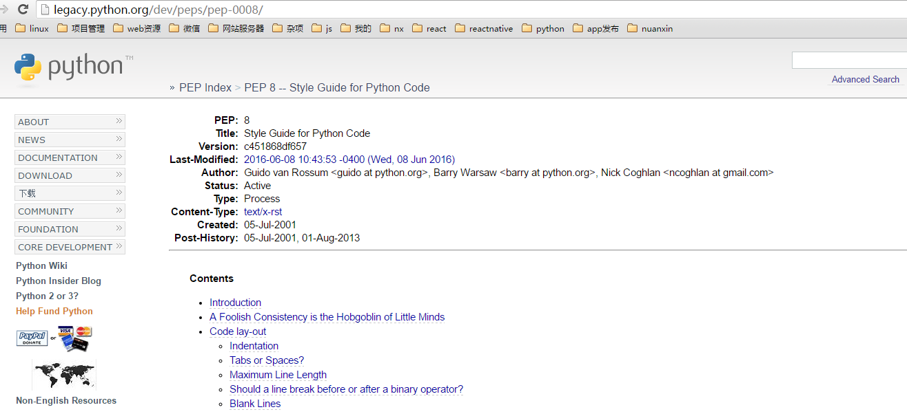

# 编码风格

### 错误认知

+ 这很浪费时间
+ 我是个艺术家
+ 所有人都能穿的鞋不会合任何人的脚
+ 我善长制定编码规范

### 正确认知

+ 促进团队合作
+ 减少bug处理 
+ 提高可读性，降低维护成本 
+ 有助于代码审查
+ 养成习惯，有助于程序员自身的成长

### pep8 编码规范

Python Enhancement Proposals ：python改进方案

[https://www.python.org/dev/peps/](https://www.python.org/dev/peps/)


pep8 官网规范地址

[https://www.python.org/dev/peps/pep-0008/](https://www.python.org/dev/peps/pep-0008/)



Guido的关键点之一是：代码更多是用来读而不是写。编码规范旨在改善Python代码的可读性。

风格指南强调一致性。项目、模块或函数保持一致都很重要。

#### 部分可以违背指南情况：

许多项目都有自己的编码风格指南，冲突时自己的指南为准。

+ 遵循指南会降低可读性。
+ 与周围其他代码不一致。
+ 代码在引入指南完成，暂时没有理由修改。
+ 旧版本兼容。
+ 代码布局

缩进

#### 每级缩进用4个空格。

括号中使用垂直隐式缩进或使用悬挂缩进。后者应该注意第一行要没有参数，后续行要有缩进。

+ Yes

```python
# 对准左括号
foo = long_function_name(var_one, var_two,
                         var_three, var_four)

# 不对准左括号，但加多一层缩进，以和后面内容区别。
def long_function_name(
        var_one, var_two, var_three,
        var_four):
    print(var_one)

# 悬挂缩进必须加多一层缩进.
foo = long_function_name(
    var_one, var_two,
    var_three, var_four)
```

+ No
```python
# 不使用垂直对齐时，第一行不能有参数。
foo = long_function_name(var_one, var_two,
    var_three, var_four)

# 参数的缩进和后续内容缩进不能区别。
def long_function_name(
    var_one, var_two, var_three,
    var_four):
    print(var_one)
```

#### 4个空格的规则是对续行可选的。
```python
# 悬挂缩进不一定是4个空格
foo = long_function_name(
  var_one, var_two,
  var_three, var_four)
if语句跨行时，两个字符关键字(比如if)加上一个空格，再加上左括号构成了很好的缩进。后续行暂时没有规定，至少有如下三种格式，建议使用第3种。

# 没有额外缩进，不是很好看，个人不推荐.
if (this_is_one_thing and
    that_is_another_thing):
    do_something()

# 添加注释
if (this_is_one_thing and
    that_is_another_thing):
    # Since both conditions are true, we can frobnicate.
    do_something()

# 额外添加缩进,推荐。
# Add some extra indentation on the conditional continuation line.
if (this_is_one_thing
        and that_is_another_thing):
    do_something()
```

#### 右边括号也可以另起一行。有两种格式，建议第2种。

```python
# 右括号不回退，个人不推荐
my_list = [
    1, 2, 3,
    4, 5, 6,
    ]
result = some_function_that_takes_arguments(
    'a', 'b', 'c',
    'd', 'e', 'f',
    )

# 右括号回退
my_list = [
    1, 2, 3,
    4, 5, 6,
]
result = some_function_that_takes_arguments(
    'a', 'b', 'c',
    'd', 'e', 'f',
)
```

#### 空格或Tab?

+ 空格是首选的缩进方法。
+ Tab仅仅在已经使用tab缩进的代码中为了保持一致性而使用。
+ Python 3中不允许混合使用Tab和空格缩进。
+ Python 2的包含空格与Tab和空格缩进的应该全部转为空格缩进。

#### 最大行宽

+ 限制所有行的最大行宽为79字符。
+ 文本长块，比如文档字符串或注释，行长度应限制为72个字符。


#### 空行

+ 两行空行分割顶层函数和类的定义。
+ 类的方法定义用单个空行分割。
+ 额外的空行可以必要的时候用于分割不同的函数组，但是要尽量节约使用。
+ 额外的空行可以必要的时候在函数中用于分割不同的逻辑块，但是要尽量节约使用。

#### 源文件编码

+ 在核心Python发布的代码应该总是使用UTF-8(ASCII在Python 2)。
+ Python 3(默认UTF-8)不应有编码声明。


#### 导入在单独行

+ Yes：
```python
import os
import sys
from subprocess import Popen, PIPE
```

+ No:
```python
import sys, os
```

+ 导入始终在文件的顶部，在模块注释和文档字符串之后，在模块全局变量和常量之前。
+ 导入顺序如下：标准库进口,相关的第三方库，本地库。各组的导入之间要有空行。

#### 推荐绝对路径导入，因为它们通常更可读，而且往往是表现更好的（或至少提供更好的错误消息。

```python
import mypkg.sibling
from mypkg import sibling
from mypkg.sibling import example
```

#### 在绝对路径比较长的情况下，也可以使用相对路径：
```python
from . import sibling
from .sibling import example
Python 3中已经禁止隐式的相对导入。
```

#### 禁止使用通配符导入。

通配符导入(from <module> import *)应该避免，因为它不清楚命名空间有哪些名称存，混淆读者和许多自动化的工具。

#### 字符串引用

+ Python中单引号字符串和双引号字符串都是相同的。注意尽量避免在字符串中的反斜杠以提高可读性。
+ 根据PEP 257, 三个引号都使用双引号。


#### 括号里边避免空格

```python
# 括号里边避免空格
# Yes
spam(ham[1], {eggs: 2})
# No
spam( ham[ 1 ], { eggs: 2 } )
```

#### 逗号，冒号，分号之前避免空格

```python
# 逗号，冒号，分号之前避免空格
# Yes
if x == 4: print x, y; x, y = y, x
# No
if x == 4 : print x , y ; x , y = y , x
```
#### 索引操作中的冒号当作操作符处理前后要有同样的空格(一个空格或者没有空格，个人建议是没有。)

```python
# Yes
ham[1:9], ham[1:9:3], ham[:9:3], ham[1::3], ham[1:9:]
ham[lower:upper], ham[lower:upper:], ham[lower::step]
ham[lower+offset : upper+offset]
ham[: upper_fn(x) : step_fn(x)], ham[:: step_fn(x)]
ham[lower + offset : upper + offset]
# No
ham[lower + offset:upper + offset]
ham[1: 9], ham[1 :9], ham[1:9 :3]
ham[lower : : upper]
ham[ : upper]
```

#### 函数调用的左括号之前不能有空格

```python
# Yes
spam(1)
dct['key'] = lst[index]

# No
spam (1)
dct ['key'] = lst [index]
```

#### 赋值等操作符前后不能因为对齐而添加多个空格

```python
# Yes
x = 1
y = 2
long_variable = 3

# No
x             = 1
y             = 2
long_variable = 3
```

#### 二元运算符两边放置一个空格

涉及 =、符合操作符 ( += , -=等)、比较( == , < , > , != , <> , <= , >= , in , not in , is , is not )、布尔( and , or , not )。

优先级高的运算符或操作符的前后不建议有空格。

```python
# Yes
i = i + 1
submitted += 1
x = x*2 - 1
hypot2 = x*x + y*y
c = (a+b) * (a-b)

# No
i=i+1
submitted +=1
x = x * 2 - 1
hypot2 = x * x + y * y
c = (a + b) * (a - b)
```

#### 关键字参数和默认值参数的前后不要加空格

```python
# Yes
def complex(real, imag=0.0):
    return magic(r=real, i=imag)

# No
def complex(real, imag = 0.0):
    return magic(r = real, i = imag)
```

#### 函数注释中，=前后要有空格，冒号和"->"的前面无空格，后面有空格。
```python
# Yes
def munge(input: AnyStr):
def munge(sep: AnyStr = None):
def munge() -> AnyStr:
def munge(input: AnyStr, sep: AnyStr = None, limit=1000):

# No
def munge(input: AnyStr=None):
def munge(input:AnyStr):
def munge(input: AnyStr)->PosInt:
```

#### 通常不推荐复合语句(Compound statements: 多条语句写在同一行)。

```python
# Yes
if foo == 'blah':
    do_blah_thing()
do_one()
do_two()
do_three()

# No
if foo == 'blah': do_blah_thing()
do_one(); do_two(); do_three()
```

#### 尽管有时可以在if/for/while 的同一行跟一小段代码，但绝不要跟多个子句，并尽量避免换行。
```python
# No
if foo == 'blah': do_blah_thing()
for x in lst: total += x
while t < 10: t = delay()
更不是：

# No
if foo == 'blah': do_blah_thing()
else: do_non_blah_thing()

try: something()
finally: cleanup()

do_one(); do_two(); do_three(long, argument,
                             list, like, this)

if foo == 'blah': one(); two(); three()
```

#### 命名风格

+ b(单个小写字母)
+ B(单个大写字母)
+ lowercase(小写串)
+ lower_case_with_underscores(带下划线的小写)
+ UPPERCASE(大写串)
+ UPPER_CASE_WITH_UNDERSCORES(带下划线的大写串)
+ CapitalizedWords(首字母大写的单词串或驼峰缩写）

注意: 使用大写缩写时，缩写使用大写字母更好。故 HTTPServerError 比 HttpServerError 更好。

mixedCase(混合大小写，第一个单词是小写)

Capitalized_Words_With_Underscores（带下划线，首字母大写，丑陋）

还有一种风格使用短前缀分组名字。这在Python中不常用， 但出于完整性提一下。例如，os.stat()返回的元组有st_mode, st_size, st_mtime等等这样的名字(与POSIX系统调用结构体一致)。


下面讲述首尾有下划线的情况:

+ _single_leading_underscore:(单前置下划线): 弱内部使用标志。 例如"from M import " 不会导入以下划线开头的对象。
+ single_trailing_underscore_(单后置下划线): 用于避免与 Python关键词的冲突。 
+ __double_leading_underscore(双前置下划线): 当用于命名类属性，会触发名字重整。 
+ __double_leading_and_trailing_underscore__(双前后下划线)：用户名字空间的魔法对象或属性。例如:__init__ ,不要自己发明这样的名字。


#### 避免采用的名字

决不要用字符'l'(小写字母el)，'O'(大写字母oh)，或 'I'(大写字母eye) 作为单个字符的变量名。一些字体中，这些字符不能与数字1和0区别。用'L' 代替'l'时。

#### 包和模块名

模块名要简短，全部用小写字母，可使用下划线以提高可读性。包名和模块名类似，但不推荐使用下划线。


