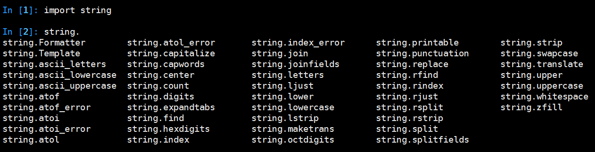
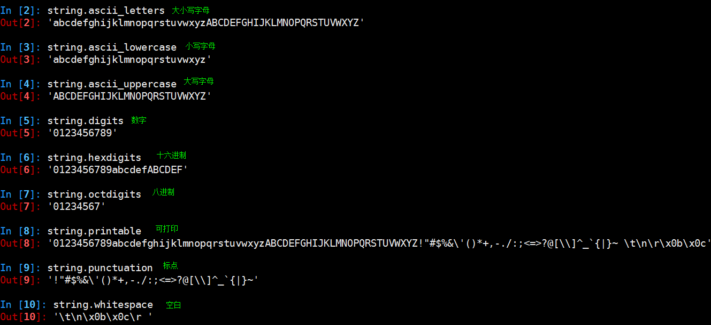
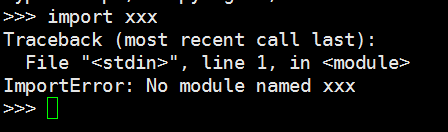

[TOC]

# python 高级教程


1. 数7游戏，把一个随机100个数里面，含7和7的倍数的值提取出来。（提示:filter）
2. 为网站图片生成缩略图(提示：map 难度：考察灵活应用,安装模块sudo apt-get install python-imaging)
3. 写一个装饰器，能记录被装饰函数的访问时间和调用者。（调用者模拟传入,记录文件自己创建，追加操作）
4. 请在纸上手写一遍一个程序的执行过程，程序见课件上讲解的那个程序。


题目2参考代码
```python
#!/usr/bin/env python
#coding: utf-8
# 安装PIL模块  sudo apt-get install python-imaging
import Image, os

# 源目录
#myPath = './'
myPath = '/'
# 输出目录
#outPath = './'
outPath = './'

def processImage(filesource, destsource, name, imgtype):
    '''
    filesource是存放待转换图片的目录
    destsource是存放输出转换后图片的目录
    name是文件名
    imgtype是文件类型
    '''
    imgtype = 'jpeg' if imgtype == '.jpg' else 'png'
    #打开图片
    im = Image.open(filesource + name)
    # 缩放比例
    rate = max(im.size[0]/640.0 if im.size[0] > 640 else 0, im.size[1]/1136.0 if im.size[1] > 1136 else 0)
    if rate:
        im.thumbnail((im.size[0]/rate, im.size[1]/rate))
    im.save(destsource + name, imgtype)

def run():
    # 切换到源目录，遍历源目录下所有图片
    os.chdir(myPath)
    for i in os.listdir(os.getcwd()):
        # 检查后缀
        postfix = os.path.splitext(i)[1]
        if postfix == '.jpg' or postfix == '.png':
            processImage(myPath, outPath, i, postfix)

if __name__ == '__main__':
    run()

```


## 函数进阶
### 程序运行原理

### 函数返回值
|返回对象数目|实际返回对象|
|--|--|
|0|None|
|1|object|
|>1|tuple|


### 可变参数传参

示例：分析运行结果

```python
def foo(arg1,*arg2,**arg3):
    print arg1
    print arg2
    print arg3

    #foo(1, 2, 3, a=23,b=24)
    #foo(1, 2, 3, a=23, 31, 41, b=24)
    #foo(1,*(2,3,4,5),**{'a':23,'b':45})  #1个*表示元祖，2个*表示字典
    #foo(1,2,3,4,5)
    #foo(1,**{'a':23,'b':45})
```

### 内建的函数
c函数的封装，如len()

### 内建的方法
包含一个隐式对象传递给c函数，如alist.append()

### 内建函数


### 多线程

Python 是通过一个全局解释器锁 GIL（Global Interpreter Lock）来实现线程同步。
当 Python 程序只有单线程时，并不会启用 GIL，而当用户创建了一个 thread 时，
表示要使用多线程，Python 解释器就会自动激活 GIL，
并创建所需要的上下文环境和数据结构。

Python 字节码解释器的工作原理是按照指令的顺序一条一条地顺序执行，Python 内部维护着一个数值，
这个数值就是 Python 内部的时钟，如果这个数值为 N，则意味着 Python 在执行了 N个时钟时间以后,应该立即启动线程调度机制，可以通过下面的代码获取这个数值。

```python
import sys
sys.getcheckinterval() # 100
```

线程调度机制将会为线程分配 GIL，获取到 GIL 的线程就能开始执行，而其他线程则必须等待。
由于 GIL 的存在，Python 的多线程性能十分低下，无法发挥多核 CPU 的优势，性能甚至不如单线程。
因此如果你想用到多核 CPU，一个建议是使用多进程 。


### 关键字

    False      class      finally    is         return
    None       continue   for        lambda     try
    True       def        from       nonlocal   while
    and        del        global     not        with
    as         elif       if         or         yield
    assert     else       import     pass
    break      except     in         raise


## 数据类型进阶
在基础班，我们学习了Python中的基础数据类型。但是，这些基础数据类型有时不能满足我们的实际开发需求。例如，在表示一个分数时，基础数据类型里面却没有分数。当然，通过基础数据类型，我们可以构造出一个分数类型。但是，这就是一个典型的重复造轮子的行为。因为Python已经为我们造好了这些“轮子”。Python的标准库中还拥有很多扩展的数据类型。数字类型、字符串类型，列表类型，字典类型，集合类型等等类型，都拥有其扩展类型。

### 数字类型扩展
#### 小数数字（decimal）

小数类型是Python标准库自带的一个模块，使用时需要导入decimal模块 `import decimal`

+ 特征: 固定精度浮点数
+ 使用场景: 货币业务
+ 入门示例


```python
In [1]: import decimal

In [2]: a=decimal.Decimal(3.14)

In [3]: b=decimal.Decimal(5.67)

In [4]: print a
3.140000000000000124344978758017532527446746826171875

In [5]: print b
5.6699999999999999289457264239899814128875732421875

In [6]: c=a+b

In [7]: print c
8.810000000000000053290705182    #默认28位精度

In [8]: decimal.getcontext().prec=4     #设置4位精度

In [9]: d=a+b

In [10]: print d
8.810

In [11]: type(d)
Out[11]: decimal.Decimal
```


+ 上下文运行环境

        decimal.getcontext()
        Context(prec=28, rounding=ROUND_HALF_EVEN, Emin=-999999999, Emax=999999999, 
        capitals=1, flags=[Inexact, Rounded], traps=[Overflow, DivisionByZero,
         InvalidOperation])

        精度位数prec，舍弃位数规则rounding(ROUND_HALF_EVEN是half时向偶数靠近)，
        指数的最大值最小值Emin、Emax，科学计数法e的大小写capitals

        科学计数法：1<a<10  ax10^n 表示为 aEn


+ 设置上下文精度

```python
decimal.getcontext().prec=4     #方法一

context = decimal.getcontext()  #方法二
content.prec = 2
decimal.setcontext(content)       
```
    
        
+ 转换成浮点数
    
```python
a=decimal.Decimal(3.14)
float(a)
```
+ 转换成字符串

```python
a=decimal.Decimal(3.14)
str(a)
```

    
#### 分数类型（fractions）
分数类型明确的保留一个分子和一个分母。从而避免了某种浮点数的不精确性和局限性。
它也是Python标准库中的一员，使用时需要导入fractions模块 `import fractions`

+ 特征: 有理数、精确、自动简化结果

+ 使用场景: 数学计算

+ 用法: 
    
```python
class fractions.Fraction(numerator=0, denominator=1) 
class fractions.Fraction(other_fraction) 
class fractions.Fraction(float) 
class fractions.Fraction(decimal) 
class fractions.Fraction(string) 

#例如：
a = fractions.Fraction(1, 3)
b = fractions.Fraction(1.25)
c = fractions.Fraction('.25')
d = fractions.Fraction('12/13')
e = fractions.Fraction(decimal.Decimal(1.23))
f = a + b
```
            


#### 布尔类型（bool）
bool是一个新的数据类型，其值为True/False。

哪些对象属于False:

    任意的空数据结构: 0， 0.0， ""(空字符串)， ()(空元祖)， [](空列表)， {}(空字典)，set()(空集合)，None。

非False即为True

#### numpy模块
+ 具体参见 [Numpy相关博客](http://blog.chinaunix.net/uid-21633169-id-4408596.html)


### 字符串扩展
Python中的字符串模块string，在py2和py3之间有很大的区别。原来string模块存在于py2中的函数在py3中取消了。因为这些都可以在字符串对象中或是其他地方找到。



在string中，常用的有:



注意: 程序中一般使用string模块中的常量，不要自己写，容易出错。
    
### 列表扩展
我们知道，在数据结构中，有一种结构称之为双端队列。它具有栈和队列的性质。它的插入和删除在队列的两端进行。在collections中，有一个称为deque的类，它就实现了双端队列。在使用时，import collections

+ 构造一个双端队列: (deque([iterable[, maxlen]]))

    deq = collections.deque(range(1,10))
    
    \# deque([1, 2, 3, 4, 5, 6, 7, 8, 9])
    
+ 添加
    + append: (从右边添加)
    
        deq.append(10)
        
        \# deque([1, 2, 3, 4, 5, 6, 7, 8, 9, 10])
    
    + appendleft: (从左边添加)
    
        deq.appendleft(0)
        
        \# deque([0, 1, 2, 3, 4, 5, 6, 7, 8, 9, 10])
        
+ 扩展
    + extend: (从右边扩展)
    
        deq.extend(range(11, 15))
        
        \# deque([0, 1, 2, 3, 4, 5, 6, 7, 8, 9, 10, 11, 12, 13, 14])
        
    + extendleft: (从左边扩展)
    
        deq.extendleft(range(-1, -5, -1))
        
        \# deque([-4, -3, -2, -1, 0, 1, 2, 3, 4, 5, 6, 7, 8, 9, 10, 11, 12, 13, 14])

+ 统计
    + count: (元素个数)
    
        deq.count(11)
        \# 1
    
    + maxlen: (队列最大长度)
    
        与队列的初始化有关。

+ 旋转

    rotate
    
    deq.rotate(n=1) 
    
    \# deque([14, -4, -3, -2, -1, 0, 1, 2, 3, 4, 5, 6, 7, 8, 9, 10, 11, 12, 13])
    
    n的默认值为1
    
    n > 0: 向右旋转;
    
    n < 0: 向左旋转。
    
+ 逆序

    reverse
    
    deq.reverse()
    
    \# deque([13, 12, 11, 10, 9, 8, 7, 6, 5, 4, 3, 2, 1, 0, -1, -2, -3, -4, 14])
    
    
+ 删除

    + pop: 从右删除
        
        deq.pop() # 14
    
    + popleft: 从左删除
    
        deq.popleft() # 13
        
    + remove
    
        deq.remove(4)
        
        \# deque([12, 11, 10, 9, 8, 7, 6, 5, 3, 2, 1, 0, -1, -2, -3, -4])
        
    + 清空
    
        clear
        
        deq.clear()
        
        \# deque([])


### 元祖扩展
虽然元祖也是一个对象，但正常情况下，元祖内的元素只能通过下标访问，因为其没有对应的属性。我们可以使用collections中的namedtuple，来定义一个新的带有属性的元祖（tuple的子类)，这样就可以实现通过属性或者下标访问元祖内的元素了。

+ 构造一个namedtuple
    
    collections.namedtuple(typename, field_names, verbose=False, rename=False)
    
    nt = collections.namedtuple('Student', ['name', 'age', 'sex'])
    
    + typename
    
        类型名: 不能与Python的关键字冲突
        
    + field_names
    
        可以是一段字符串(以空格隔开)，也可以是一个元祖/列表/集合。
        
        field_names中不能有相同的值(结合rename)
        
    + verbose
    
        打印出这个新的元祖的定义
        
    + rename
    
        如果field_names中有相同的值，且rename值为默认值False，则抛出异常
        
        否则field_names中后面的名字会被重新命名
        
        规则为: 下划线 + 下标
        
        example:
        
            nt = collections.namedtuple('Student', 'name age sex age', rename=True)
            nt('zhangsan', 27, '男', '未知')
            Student(name='zhangsan', age=27, sex='男', _3='未知')


### 字典扩展
#### defaultdict
当需要给字典元素添加默认值时，collections中的defaultdict是一个很好的选择。`import collections`

+ 构造一个默认字典

    defaultdict(default_factory[, ...])
    
    default_factory表示默认的工厂，本质是一个函数，不带参数。default_factory的其余参数同dict
    
    d = collections.defaultdict(list) \# 表示构造了一个字典value默认值为list()，也就是[]的字典
    
+ 操作
    
    + default_factory: (给默认字典添加默认工厂函数)
        
        dd = collections.defaultdict()
        dd.default_factory = list
    
    + 其它操作同dict
    
        example: 
    
        + 更新字典
    
            d.update(name='zhangsan') \# defaultdict(list, {'name': 'zhangsan'})
    
        + 扩展字典
    
            d['key1'].extend(range(5))  \# defaultdict(list, {'key1': [0, 1, 2, 3, 4], 'name': 'zhangsan'})
    
+ 好处

    在初始化时，已经写好key对应value的初始值，以后使用时当key不存在时，直接使用这个默认值。
    

#### OrderedDict
默认字典中key的排序是无序的。当需要字典中的键以加入时的顺序存在时，我们需要collections中的OrderedDict。

+ 构造一个OrderedDict

    od = collections.OrderedDict(*args, **kwds)
    
    od = collections.OrderedDict()
    od.update(username="zhangsan", age=27, sex="男")

+ 操作
    
    + move_to_end
        
        move_to_end(key, last=True) \# 将选定的key移动到有序字典的开头或结尾，last=True/False分别表示结尾和开头
        
        od.move_to_end("username")  \# OrderedDict([('age', 27), ('sex', '男'), ('username', 'zhangsan')])
        
        od.move_to_end("sex", False) \# OrderedDict([('sex', '男'), ('age', 27), ('username', 'zhangsan')])

    + 其它操作同dict
    
    + 注意
    
        不推荐使用关键字参数形式构建有序字典，因为插入的顺序是任意的。想要保证插入顺序，需要每一个元素单独插入。
        
        collections.OrderedDict(username="zhangsan", age=27, sex="男")
        
        \# OrderedDict([('sex', '男'), ('age', 27), ('username', 'zhangsan')])


### 集合
集合(set)是类似于数学概念中的集合。具有唯一、无序、不可变的特点。它支持并、交、补运算。

+ 构造一个集合

    + s = {1,2,3,4}
        
        注意: {}是创建一个空字典。
    + s = set()
        
        创建一个空集合
        
    + set(iterable)
        
        s = set(range(10))
        
+ 操作
    
    + 添加
    
        add
        
    + 并/交/补/对称差
        
        union(|) /intersection(&)/ difference(-) / symmetric_difference
    
    + 更新
    
        并更新 / 交更新 / 补更新 / 对称更新
        
        update / intersection_update / difference_update / symmetric_difference_update
    
    + 删除
    
        + remove
            没有元素在集合中，抛出KeyError异常
        
        + remove: 
            没有元素在集合中，什么都不做
            
        + pop
            随机删除一个元素并返回该元素，如果该集合为空，则抛出KeyError异常
        
        + clear
            清空集合
        
    + 复制
        + copy 
            复制集合
            
    + 逻辑判断
        + isdisjoint
            两个集合没有交集返回True, 否则返回False
            
        + issubset
            是否为另一个集合的子集
            
        + issuperset
            是否为另一个集合的超集


## 字符串编解码进阶
### 字符串基础知识
+ 字符编码方法
+ Python字符串类型
+ 文本和二进制文件

### py3的字符串应用
+ 常量和基本属性
+ 转换

### py3编码Unicode字符串
+ 编码ASCII文本
+ 编码非ASCII文本
+ 编码和解码非ASCII文本
+ 转换编码

### py2中编码Unicode字符串

### 使用py3的bytes对象

### 使用py3和py2的bytearray对象

### 总结py2和py3的区别


## 程序结构进阶
### 循环技巧
+ 循环计数器: while/range
+ 非完备遍历: range和分片
+ 修改列表: range
+ 并行遍历: zip/map
+ 产生偏移和元素: enumerate


## 函数进阶
### lambda表达式
+ lambda表达式简介
+ lambda表达式举例

### map
+ 作用
+ 举例

### filter
+ 作用
+ 举例

### reduce
+ 作用
+ 举例

### 迭代器和解析
+ iter/next
+ range/map/zip/filter
+ 多个迭代器VS单个迭代器
+ 生成器
    + yield vs return
    + 生成器函数 vs 生成器表达式

### 装饰器
#### 闭包
如果在一个内部函数里，对在外部作用域的变量(但不是全局变量)进行引用，那么内部函数就被认为是闭包(_closure)。定义在外部函数内的但由内部函数引用或者使用的变量被称为自由变量。
#### 装饰器简介

#### 二层装饰器
+ 语法
+ 举例

#### 三层装饰器
+ 语法
+ 举例

#### 类装饰器
+ 语法
+ 举例


### 运算符重载
+ 索引和分片
    + \_\_getitem\_\_ 和 \_\_setitem\_\_
+ 迭代器对象
    + \_\_iter\_\_  和 \_\_next\_\_
+ 成员关系
    + \_\_contains\_\_ 、 \_\_iter\_\_ 、 \_\_getitem\_\_
+ 属性引用
    + \_\_getattr\_\_ 和  \_\_setattr\_\_
+ 字符串
    + \_\_str\_\_ 和 \_\_repr\_\_
+ 右侧加法和原处加法
    + \_\_radd\_\_ 和 \_\_iadd\_\_
+ call表达式
    + \_\_call\_\_
+ 比较
    + \_\_lt\_\_  \_\_gt\_\_
+ 布尔
    + \_\_bool\_\_ 和 \_\_len\_\_
+ 析构函数
    + \_\_del\_\_


## 异常进阶
### 异常简介
### 异常类
### 捕获异常-try/except/finally/else
### 抛出异常
+ raise
+ raise/from
### assert
### with/as环境管理器


## 模块进阶

文件是物理上组织模块的方法，一个文件可以看作是一个独立的模块，一个模块也可以看作是一个文件，模块的文件名就是模块的名字加上扩展名.py

### 模块导入顺序

1. python标准库模块
2. python第三方模块
3. 应用程序自定义模块

用一个空行分割这三类模块的导入语句

导入模块
```python
import module1
from module1 import xx
from module1 import xx, yy, zz    #不建议
from module1 import (xx, yy, zz)  #程序员正确姿势
from module1 import *             #避免使用，命名覆盖冲突

import module1 as md1             #简化名称
from module1 import xxxx as 4x    #简化名称
```

### 模块搜索路径
当导入模块时，需要从一个预定义区域中查找。



#### import 搜索路径 

```python
import sys
sys.path
```

#### 路径搜索

从上面列出的目录里依次查找要导入的模块文件

#### 程序执行时导入模块路径

```python
sys.path.append('/home/itcast/xxx')
sys.path.insert(0, '/home/itcast/xxx')    #可以确保先搜索这个路径
```
#### 设置Linux下导入模块路径

```shell
echo $PYTHONPATH
export PYTHONPATH=$PYTHONPATH:'/home/itcast/xxx'
```

#### 设置Windows下导入模块路径

### 重新导入模块
模块被导入后，`import module`不能重新导入模块，重新导入需用

```python
reload(module)
```


### importlib


## 常用标准库和扩展库进阶


## 附录
### markdown语法
### gitbook
### python解释器
Python解释器

#### CPython

官方版本的解释器CPython。这个解释器是用C语言开发的，所以叫CPython。在命令行下运行python就是启动CPython解释器,也是使用最广的Python解释器。

#### IPython

IPython是基于CPython之上的一个交互式解释器，IPython只是在交互方式上有所增强，但是执行Python代码的功能和CPython是完全一样的。

+ CPython用>>>作为提示符，
+ IPython用In [序号]:作为提示符。

### 协程

